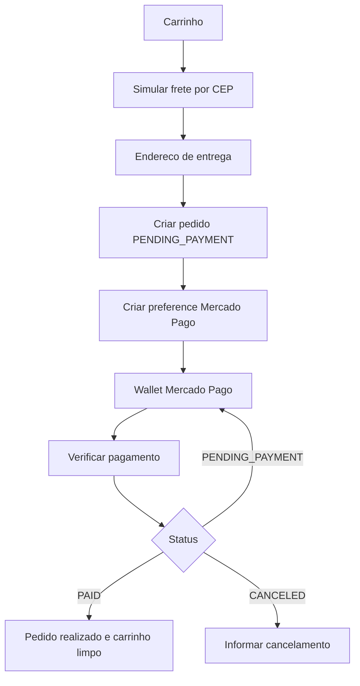

# Blueprint 01 - Produto e Fluxos

## Visao do produto

ILUMINE e um e-commerce de materiais eletricos. A experiencia atual combina vitrine publica, carrinho, checkout com Mercado Pago, calculo de frete via Correios, consulta de endereco por CEP, area do cliente e backoffice administrativo.

O rebuild deve manter a estrutura funcional existente, mas elevar acabamento, robustez e consistencia.

## Publicos

- Visitante: navega pela home, busca produtos, filtra por categoria, ve ofertas e detalhes.
- Cliente logado: compra com dados pre-preenchidos, acompanha historico em `/account`.
- Cliente convidado: compra informando nome, email e endereco no checkout.
- Admin: acessa `/admin`, gerencia produtos, estoque, status e pedidos.
- Provedores externos: Mercado Pago, Correios e Google Geocoding.

## Rotas frontend preservadas

| Rota | Tela | Responsabilidade |
| --- | --- | --- |
| `/` | Home | Hero, beneficios, categorias, ofertas, mais vendidos, todos os produtos, busca e filtro. |
| `/produto/:slug` | Produto | Detalhe do produto, preco, desconto, quantidade, especificacoes, adicionar/comprar. |
| `/cart` | Checkout | Carrinho, simulacao de frete, endereco, pagamento e confirmacao inline. |
| `/checkout/result` | Resultado | Retorno Mercado Pago e verificacao do status do pedido. |
| `/login` | Login | Login com email/senha. |
| `/register` | Cadastro | Criacao de conta de cliente. |
| `/account` | Minha conta | Dados do usuario, logout e historico de pedidos. |
| `/admin` | Admin | Dashboard, produtos/estoque e pedidos. |

## Fluxo 1 - Navegacao e descoberta

1. Usuario entra em `/`.
2. Header mostra logo, busca central, links de conta/admin/carrinho e menu de categorias.
3. Home carrega em paralelo:
   - `GET /categories`
   - `GET /products`
   - `GET /products?specialOffer=true&limit=8`
   - `GET /products?bestSeller=true&limit=8`
4. Busca no header altera query `?search=...`.
5. Categoria altera query `?category=slug`.
6. Lista `Todos os Produtos` respeita busca e categoria.
7. Cards exibem imagem, desconto, rating, preco antigo, preco atual e acao de adicionar.

## Fluxo 2 - Produto

1. Usuario acessa `/produto/:slug`.
2. Frontend chama `GET /products/:slug`.
3. Tela exibe imagem, desconto, rating, preco, parcelamento, descricao, seletor de quantidade e especificacoes.
4. `Adicionar ao Carrinho` soma no carrinho local.
5. `Comprar Agora` adiciona ao carrinho e navega para `/cart`.
6. Quantidade nao pode ficar menor que 1 nem passar do estoque carregado.

## Fluxo 3 - Carrinho e checkout

O fluxo atual e um wizard dentro de `/cart`.

Etapas preservadas:

1. Carrinho:
   - Lista itens.
   - Permite aumentar/diminuir/remover/limpar.
   - Simula frete por CEP.
   - Mostra subtotal, frete e total.
2. Endereco:
   - Dados do cliente.
   - CEP, rua, numero, complemento, bairro, cidade, estado.
   - Busca cidade/estado/rua/bairro por CEP.
   - Calcula frete real antes do pagamento.
3. Pagamento:
   - Cria pedido.
   - Cria preference Mercado Pago.
   - Renderiza Wallet.
   - Botao "Ja paguei, verificar confirmacao".
4. Confirmacao:
   - Status `PAID`.
   - Carrinho limpo.
   - Link para `/account`.

## Fluxo 4 - Resultado do pagamento

1. Mercado Pago retorna para `/checkout/result?orderId=<id>&token=<checkoutToken>`.
2. Frontend chama `GET /orders/:id/status?token=...&sync=true`.
3. Backend tenta sincronizar com Mercado Pago se o pedido ainda esta pendente.
4. Tela mostra:
   - Aprovado: link para `/account`.
   - Pendente ou cancelado: link para `/cart`.

## Fluxo 5 - Autenticacao e conta

1. Cadastro:
   - `/register`
   - `POST /auth/register`
   - Persistir token e usuario em `localStorage`.
   - Navegar para `/account`.
2. Login:
   - `/login`
   - `POST /auth/login`
   - Persistir token e usuario em `localStorage`.
   - Navegar para `/account`.
3. Hidratacao:
   - Ao iniciar com token, chamar `GET /auth/me`.
   - Se falhar, limpar token e usuario locais.
4. Conta:
   - Se deslogado, pedir login/cadastro.
   - Se logado, mostrar dados, logout e `GET /orders/me`.

## Fluxo 6 - Admin

1. Usuario acessa `/admin`.
2. Frontend exige token com `role=ADMIN`.
3. Se nao autorizado, exibe aviso e link de login.
4. Se autorizado, carrega:
   - `GET /admin/dashboard`
   - `GET /admin/products`
   - `GET /admin/orders`
   - `GET /categories`
5. Abas:
   - Dashboard: KPIs.
   - Produtos e Estoque: criar, editar, ativar/inativar.
   - Pedidos: listar, marcar como pago, cancelar.

## Catalogo inicial

Categorias seed preservadas:

- Lamps (`lamps`)
- Cables & Wires (`cables-wires`)
- Switches (`switches`)
- Outlets (`outlets`)
- Tools (`tools`)
- Circuit Breakers (`circuit-breakers`)

Produtos seed preservados como conteudo inicial:

- LED Bulb 12W E27
- Warm LED Panel 24W
- Flexible Cable 2.5mm 100m
- Parallel Wire 1.5mm 50m
- 3-Way Switch Kit
- Dual USB Outlet
- Insulated Screwdriver Set
- Digital Multimeter
- DIN Circuit Breaker 32A

## Melhorias obrigatorias no rebuild

- Padronizar idioma da UI em pt-BR. Hoje ha mistura de portugues e ingles.
- Corrigir caracteres quebrados e icones representados como `?`.
- Adicionar estados de erro por tela, nao apenas mensagens cruas do backend.
- Adicionar empty states melhores para lista de produtos, pedidos e carrinho.
- Preservar os fluxos, mas melhorar acessibilidade, foco, labels, contraste e responsividade.
- Evitar que a UI permita avancar para pagamento sem frete valido e endereco valido.

