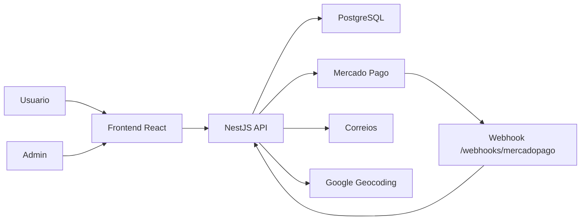

# Blueprint 02 - Arquitetura e Modulos

## Stack atual a preservar

- Frontend: React 18, TypeScript, Vite, React Router.
- Backend: NestJS 10, TypeScript.
- Banco: PostgreSQL 16, Prisma 5.
- Pagamento: Mercado Pago SDK.
- Auth: JWT com `jsonwebtoken` e senha com `bcryptjs`.
- Infra local: Docker Compose para PostgreSQL.

## Arquitetura alvo



## Estrutura atual

```text
site_ilumine/
  backend/
    prisma/
    src/
      admin/
      auth/
      categories/
      checkout/
      logging/
      orders/
      prisma/
      products/
      webhooks/
  frontend/
    src/
      components/
      lib/
      pages/
      state/
      types/
```

## Estrutura recomendada para rebuild

Preservar dominios, mas separar contratos, casos de uso e UI por feature.

```text
backend/src/
  app.module.ts
  main.ts
  common/
    auth/
    config/
    errors/
    logging/
    validation/
  prisma/
  modules/
    auth/
    catalog/
      categories/
      products/
    orders/
    checkout/
    webhooks/
    admin/
```

```text
frontend/src/
  app/
    App.tsx
    router.tsx
    providers.tsx
  shared/
    api/
    components/
    format/
    types/
    ui/
  features/
    auth/
    catalog/
    cart/
    checkout/
    account/
    admin/
  styles/
```

## Backend - limites de modulo

### Auth

Responsavel por:

- Cadastro.
- Login.
- Geracao/verificacao de JWT.
- Perfil `/auth/me`.
- Helper/guard de usuario autenticado e admin.

Melhoria recomendada:

- Trocar validacao manual de authorization header em controllers por guards:
  - `JwtAuthGuard`
  - `AdminGuard`
- Centralizar payload do usuario em decorator `@CurrentUser()`.

### Catalogo

Responsavel por:

- Categorias publicas.
- Produtos publicos ativos.
- Filtros por busca, categoria, preco, oferta e mais vendidos.
- Detalhe por slug.

Melhoria recomendada:

- Separar `CatalogService` de `AdminProductsService`.
- Adicionar indices de banco para `Product.status`, `Product.categoryId`, flags e `createdAt`.
- Normalizar resposta de Decimal para numero/string de forma consistente.

### Orders

Responsavel por:

- Criacao de pedido.
- Simulacao de frete.
- Consulta de endereco por CEP.
- Consulta segura de status pelo `checkoutToken`.
- Historico do usuario.
- Transicoes de status e estoque.

Melhoria recomendada:

- Extrair servicos:
  - `ShippingService`
  - `AddressLookupService`
  - `InventoryService`
  - `OrderStatusService`
- Manter regra de estoque transacional.

### Checkout

Responsavel por:

- Criar preference no Mercado Pago para pedido existente.
- Configurar payer, items, metadata, notification_url e back_urls quando URL for HTTPS publica.

Melhoria recomendada:

- Proteger criacao de preference contra pedidos cancelados/pagos.
- Validar que preference so pertence ao usuario dono do pedido quando houver usuario logado.
- Persistir identificador de preference/pagamento em tabela dedicada se evoluir o fluxo.

### Webhooks

Responsavel por:

- Receber webhook Mercado Pago.
- Descobrir payment id por body, resource ou query.
- Consultar pagamento no Mercado Pago.
- Registrar evento idempotente em `WebhookEvent`.
- Marcar pedido como pago se status for `approved`.

Melhoria recomendada:

- Usar `MERCADO_PAGO_WEBHOOK_SECRET` para validar assinatura.
- Logar payload minimo e evitar excesso de dados pessoais.
- Ter fila/retry para falhas externas.

### Admin

Responsavel por:

- Dashboard.
- Lista e formulario de produtos.
- Estoque e status de produto.
- Lista e status de pedidos.

Melhoria recomendada:

- Paginar pedidos.
- Adicionar busca/filtro no frontend de admin.
- Expor detalhe de pedido se necessario usando endpoint ja existente `GET /admin/orders/:id`.

## Frontend - limites de feature

### Shared

- Cliente HTTP.
- Tipos compartilhados.
- Formatadores (`toCurrencyBRL`, `decimalToNumber`).
- Componentes base: button, input, select, empty state, alert, table, modal, tabs.

### Auth

- Provider de autenticacao.
- Login.
- Cadastro.
- Minha conta.
- Guards de rota para admin.

### Catalog

- Home.
- Cards de produto.
- Busca e filtro.
- Pagina de produto.

### Cart e Checkout

- Provider de carrinho.
- Wizard do checkout.
- Simulacao de frete.
- Formulario de endereco.
- Mercado Pago Wallet.
- Resultado de pagamento.

### Admin

- Dashboard.
- Gerenciamento de produtos.
- Gerenciamento de pedidos.

## Estado de aplicacao

Preservar:

- Carrinho em `localStorage` com chave `ilumine-cart`.
- Token em `localStorage` com chave `ilumine-token`.
- Usuario em `localStorage` com chave `ilumine-user`.

Melhoria recomendada:

- Validar shape lido do `localStorage`.
- Criar versao de schema para carrinho.
- Rebuscar produtos do carrinho antes do checkout para evitar preco/estoque stale.
- Usar uma camada de server state para cache, loading, retry e invalidacao.

## API client

Preservar `VITE_API_URL`.

Melhoria recomendada:

- Criar cliente tipado por endpoint.
- Centralizar parse de erro JSON/texto.
- Adicionar suporte a abort/cancel.
- Adicionar interceptador leve para 401 limpar sessao.

## Configuracao

Backend `.env`:

- `DATABASE_URL`
- `PORT`
- `FRONTEND_URL`
- `BACKEND_URL`
- `JWT_SECRET`
- `MERCADO_PAGO_ACCESS_TOKEN`
- `MERCADO_PAGO_PUBLIC_KEY`
- `MERCADO_PAGO_WEBHOOK_SECRET`
- `CORREIOS_*`
- `GOOGLE_MAPS_API_KEY`
- `GOOGLE_GEOCODING_BASE_URL`

Frontend `.env`:

- `VITE_API_URL`
- `VITE_MERCADO_PAGO_PUBLIC_KEY`

## Observabilidade

Atual:

- Logger grava em `backend/logs/app-YYYY-MM-DD.log`.
- Retencao de 3 dias.
- Log HTTP por request.
- Tratamento de `uncaughtException` e `unhandledRejection`.

Rebuild:

- Manter log em arquivo para ambiente local.
- Adicionar request id.
- Padronizar erros com status, code e message.
- Adicionar `/health` para banco e app.
- Evitar logar token, senha, dados completos de pagamento ou payload sensivel.

