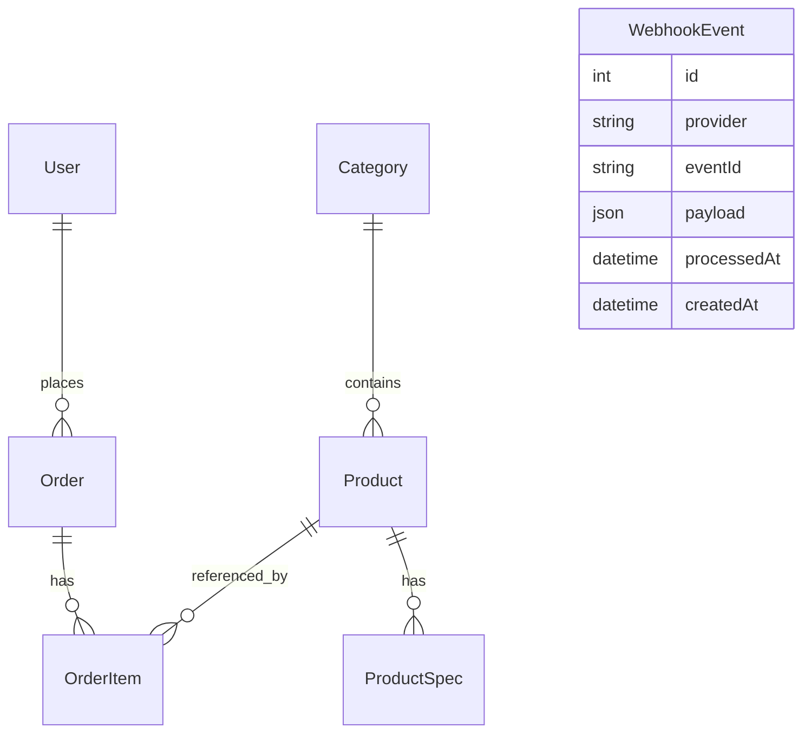
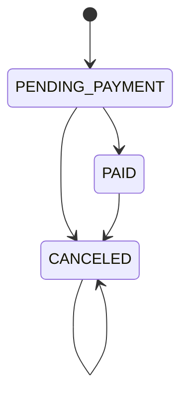

# Blueprint 03 - Dados e Regras de Negocio

## Modelo de dados preservado

## Enums

### UserRole

- `USER`
- `ADMIN`

### ProductStatus

- `ACTIVE`
- `INACTIVE`

### OrderStatus

- `PENDING_PAYMENT`
- `PAID`
- `CANCELED`

## Entidades

### User

| Campo | Tipo | Regra |
| --- | --- | --- |
| `id` | Int | Autoincremento. |
| `name` | String | Obrigatorio. |
| `email` | String | Unico, salvo em lowercase. |
| `passwordHash` | String | Hash bcrypt. |
| `role` | UserRole | Default `USER`. |
| `createdAt` | DateTime | Default now. |
| `updatedAt` | DateTime | Atualizado automaticamente. |

Relacionamento: um usuario pode ter muitos pedidos.

### Category

| Campo | Tipo | Regra |
| --- | --- | --- |
| `id` | Int | Autoincremento. |
| `name` | String | Nome exibido. |
| `slug` | String | Unico, usado em filtros. |
| `createdAt` | DateTime | Default now. |
| `updatedAt` | DateTime | Atualizado automaticamente. |

### Product

| Campo | Tipo | Regra |
| --- | --- | --- |
| `id` | Int | Autoincremento. |
| `name` | String | Nome exibido. |
| `slug` | String | Unico, rota `/produto/:slug`. |
| `description` | String | Descricao de card/detalhe. |
| `imageUrl` | String | URL da imagem principal. |
| `price` | Decimal(10,2) | Preco de venda. |
| `listPrice` | Decimal(10,2) | Preco de lista para desconto. |
| `rating` | Decimal(2,1) | Media exibida. |
| `stock` | Int | Quantidade disponivel. |
| `status` | ProductStatus | Default `ACTIVE`. |
| `isBestSeller` | Boolean | Flag de mais vendido. |
| `isSpecialOffer` | Boolean | Flag de oferta. |
| `categoryId` | Int | FK para categoria. |
| `createdAt` | DateTime | Default now. |
| `updatedAt` | DateTime | Atualizado automaticamente. |

Relacionamentos:

- Produto pertence a uma categoria.
- Produto tem muitas especificacoes.
- Produto pode aparecer em muitos itens de pedido.

### ProductSpec

| Campo | Tipo | Regra |
| --- | --- | --- |
| `id` | Int | Autoincremento. |
| `productId` | Int | FK para produto. |
| `key` | String | Nome da especificacao. |
| `value` | String | Valor da especificacao. |

Regra: specs sao removidas em cascade ao remover produto.

### Order

| Campo | Tipo | Regra |
| --- | --- | --- |
| `id` | Int | Autoincremento. |
| `checkoutToken` | String | Unico, gerado por UUID. |
| `customerName` | String | Obrigatorio para convidado; pode vir do usuario logado. |
| `customerEmail` | String | Obrigatorio para convidado; pode vir do usuario logado. |
| `shippingZipCode` | String | CEP de entrega. |
| `shippingStreet` | String | Rua. |
| `shippingNumber` | String | Numero. |
| `shippingComplement` | String? | Complemento. |
| `shippingDistrict` | String | Bairro. |
| `shippingCity` | String | Cidade. |
| `shippingState` | String | Estado. |
| `status` | OrderStatus | Default `PENDING_PAYMENT`. |
| `subtotal` | Decimal(10,2) | Soma dos itens. |
| `shipping` | Decimal(10,2) | Frete real. |
| `total` | Decimal(10,2) | Subtotal + frete. |
| `userId` | Int? | FK opcional para usuario. |
| `paidAt` | DateTime? | Data de pagamento confirmado. |
| `createdAt` | DateTime | Default now. |
| `updatedAt` | DateTime | Atualizado automaticamente. |

### OrderItem

| Campo | Tipo | Regra |
| --- | --- | --- |
| `id` | Int | Autoincremento. |
| `orderId` | Int | FK para pedido. |
| `productId` | Int | FK para produto. |
| `quantity` | Int | Minimo 1. |
| `unitPrice` | Decimal(10,2) | Snapshot do preco no momento do pedido. |

### WebhookEvent

| Campo | Tipo | Regra |
| --- | --- | --- |
| `id` | Int | Autoincremento. |
| `provider` | String | Exemplo: `mercadopago`. |
| `eventId` | String | Unico, garante idempotencia. |
| `payload` | Json | Registro do webhook/query/payment minimo. |
| `processedAt` | DateTime | Default now. |
| `createdAt` | DateTime | Default now. |

## Regras de pedido

### Criacao

1. Aceitar usuario logado ou convidado.
2. Se logado, usar `user.name` e `user.email` quando `customerName`/`customerEmail` nao vierem.
3. Se convidado, exigir `customerName` e `customerEmail`.
4. Exigir endereco completo.
5. Agrupar itens repetidos por `productId`.
6. Buscar apenas produtos `ACTIVE`.
7. Se algum produto nao existir ou estiver indisponivel, retornar erro.
8. Se estoque menor que quantidade agregada, retornar erro.
9. Calcular subtotal com preco atual do banco.
10. Calcular frete real via Correios usando CEP.
11. Criar pedido `PENDING_PAYMENT` com `checkoutToken`.
12. Criar `OrderItem` com snapshot de `unitPrice`.

### Estoque

- Nao baixar estoque na criacao do pedido.
- Baixar estoque apenas na transicao para `PAID`.
- Baixa de estoque deve ser transacional.
- Para cada item, atualizar produto com condicao `stock >= quantity`.
- Se qualquer item falhar, abortar transacao.
- Se pedido `PAID` for cancelado, restaurar estoque.

### Transicoes de status

Transicoes proibidas:

- `CANCELED -> PAID`

Transicoes idempotentes:

- Qualquer status para ele mesmo retorna sem alterar estoque novamente.

## Regras de catalogo

- Publico so enxerga produtos `ACTIVE`.
- Filtros publicos:
  - `search`: contem no nome, case-insensitive.
  - `category`: slug da categoria.
  - `minPrice` e `maxPrice`.
  - `bestSeller`.
  - `specialOffer`.
  - `limit` default 24.
  - `offset` default 0.
- Detalhe publico busca por `slug` e `ACTIVE`.

## Regras de admin

- Apenas `ADMIN` acessa `/admin/*`.
- Admin ve produtos ativos e inativos.
- Criar/editar produto exige categoria existente.
- Edicao substitui specs quando `specifications` e enviado.
- Status de produto pode alternar entre `ACTIVE` e `INACTIVE`.
- Estoque pode ser atualizado diretamente para valor >= 0.
- Admin pode marcar pedido pendente como pago ou cancelar.

## Seed inicial

Preservar:

- 6 categorias.
- 9 produtos.
- Usuario admin de desenvolvimento.

Melhoria recomendada:

- Separar seed demo de seed obrigatorio.
- Documentar que `Admin@123` e apenas desenvolvimento.
- Adicionar script para reset local seguro.

## Indices recomendados

Manter unicos atuais:

- `User.email`
- `Category.slug`
- `Product.slug`
- `Order.checkoutToken`
- `WebhookEvent.eventId`

Adicionar no rebuild:

- `Product(status, createdAt)`
- `Product(categoryId, status)`
- `Product(isBestSeller, status)`
- `Product(isSpecialOffer, status)`
- `Order(userId, createdAt)`
- `Order(status, createdAt)`
- `Order(customerEmail)`

## Cuidados com dinheiro

- Banco deve continuar usando Decimal(10,2).
- Backend deve converter Decimal de forma consistente na resposta.
- Frontend deve formatar em `pt-BR` com `BRL`.
- Evitar calculos financeiros somente com float quando regras ficarem mais complexas.

