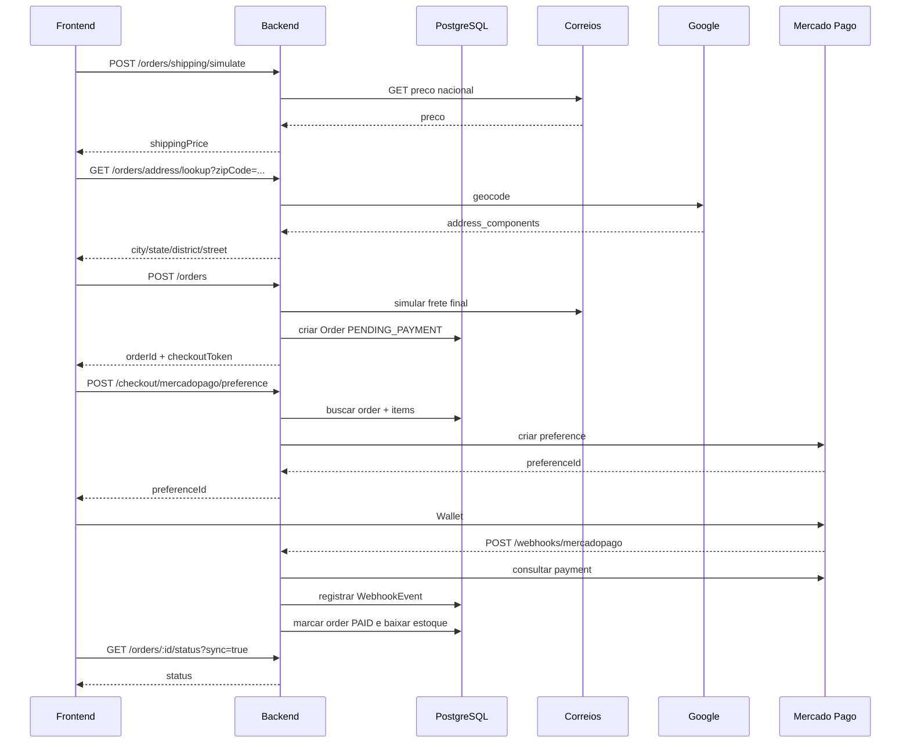

# Blueprint 06 - Checkout e Integracoes

## Visao geral

O checkout depende de tres integracoes externas:

- Correios: calculo de frete real.
- Google Geocoding: preenchimento de endereco por CEP.
- Mercado Pago: pagamento, retorno e webhook.

O rebuild deve preservar o mesmo fluxo, mas isolar cada integracao em servicos proprios e tratar falhas com mensagens claras.

## Sequencia completa



## Correios

### Configuracao

Variaveis:

- `CORREIOS_API_TOKEN`
- `CORREIOS_PRECO_BASE_URL`
- `CORREIOS_SERVICE_CODE`
- `CORREIOS_ORIGIN_ZIP_CODE`
- `CORREIOS_WEIGHT_GRAMS`
- `CORREIOS_OBJECT_TYPE`
- `CORREIOS_LENGTH_CM`
- `CORREIOS_WIDTH_CM`
- `CORREIOS_HEIGHT_CM`
- `CORREIOS_DIAMETER_CM`
- `CORREIOS_CONTRACT_NUMBER`
- `CORREIOS_DR_NUMBER`

### Request atual

Endpoint externo:

```text
GET {CORREIOS_PRECO_BASE_URL}/nacional/{serviceCode}?cepDestino=...&cepOrigem=...&psObjeto=...
```

Headers:

```text
Accept: application/json
Authorization: Bearer <CORREIOS_API_TOKEN>
```

### Regras atuais

- `destinationZipCode` deve ter 8 digitos.
- `serviceCode`, `originZipCode` e `weightGrams` sao obrigatorios por payload ou env.
- `objectType=2` exige comprimento, largura e altura.
- `objectType=3` exige comprimento e diametro.
- Preco e extraido de `pcFinal`.
- Valor `"1.234,56"` vira `1234.56`.

### Melhorias

- Criar `ShippingProvider` com interface testavel.
- Cachear simulacoes recentes por CEP/itens se necessario.
- Ter timeout.
- Ter erro amigavel para indisponibilidade.
- Nao acoplar frete a peso fixo para sempre. Futuro: calcular peso/dimensoes por produto.

## Google Geocoding

### Configuracao

- `GOOGLE_MAPS_API_KEY`
- `GOOGLE_GEOCODING_BASE_URL`

### Request atual

```text
GET {GOOGLE_GEOCODING_BASE_URL}?address=<CEP>, Brazil&key=<key>&language=pt-BR&region=br
```

### Response interna

```json
{
  "zipCode": "01001001",
  "city": "Sao Paulo",
  "state": "SP",
  "district": "Se",
  "street": "Praca da Se"
}
```

### Melhorias

- Considerar ViaCEP como fallback ou alternativa primaria para CEP brasileiro.
- Tratar CEP valido sem rua/bairro como preenchimento parcial.
- Mostrar que numero e complemento continuam manuais.

## Mercado Pago

### Configuracao

Backend:

- `MERCADO_PAGO_ACCESS_TOKEN`
- `BACKEND_URL`
- `FRONTEND_URL`
- `MERCADO_PAGO_WEBHOOK_SECRET`

Frontend:

- `VITE_MERCADO_PAGO_PUBLIC_KEY`

### Criacao de preference

Payload para Mercado Pago deve incluir:

- `external_reference`: id do pedido.
- `notification_url`: `{BACKEND_URL}/webhooks/mercadopago`.
- `payer.name`: nome do cliente.
- `payer.email`: email do cliente.
- `items`: produtos do pedido.
- `metadata.orderId`.
- `metadata.checkoutToken`.
- `back_urls` e `auto_return` apenas se URL de retorno for HTTPS publica.

### Wallet frontend

- Inicializar `initMercadoPago(publicKey, { locale: "pt-BR" })`.
- Renderizar `Wallet` somente com `preferenceId`.
- Se nao houver public key, mostrar mensagem de configuracao.

### Webhook

Processamento:

1. Extrair `paymentId`.
2. Consultar pagamento no Mercado Pago.
3. Normalizar `status`.
4. Gerar `eventId = mp:payment:<paymentId>:status:<status>`.
5. Criar `WebhookEvent`.
6. Se duplicado, retornar idempotente.
7. Se `approved`, chamar `markAsPaid(orderId)`.
8. Se marcar pedido falhar, remover evento para retry.

### Sincronizacao manual

Endpoint:

```text
GET /orders/:id/status?token=<checkoutToken>&sync=true
```

Se pedido pendente e houver access token, backend busca:

```text
GET https://api.mercadopago.com/v1/payments/search?external_reference=<orderId>&sort=date_created&criteria=desc&limit=10
```

Se qualquer pagamento estiver `approved`, pedido vira `PAID`.

## Estados de pagamento

| Mercado Pago | Status interno atual |
| --- | --- |
| `approved` | `PAID` |
| outros | permanece `PENDING_PAYMENT` |
| cancelamento admin | `CANCELED` |

Melhoria:

- Registrar status externo bruto para auditoria.
- Tratar `rejected`, `cancelled`, `refunded`, `charged_back` em um historico futuro.
- Nao mapear automaticamente todos os status negativos para `CANCELED` sem regra clara.

## Seguranca

Obrigatorio no rebuild:

- Validar assinatura do webhook usando `MERCADO_PAGO_WEBHOOK_SECRET`.
- Nunca expor `MERCADO_PAGO_ACCESS_TOKEN` no frontend.
- Nao aceitar marcar pedido como pago a partir do frontend sem validacao admin/webhook.
- `checkoutToken` deve ser imprevisivel e unico.
- Evitar logs com token, authorization header ou dados completos de pagamento.

## Falhas e mensagens

Casos esperados:

- Correios sem token: backend retorna erro de configuracao.
- Correios fora: usuario ve "Nao foi possivel calcular o frete agora".
- CEP invalido: usuario ve "Informe um CEP com 8 digitos".
- Google sem key: backend retorna erro de configuracao.
- Mercado Pago sem token/public key: mensagem clara no checkout.
- Pagamento pendente: manter na etapa 3 e permitir verificar novamente.
- Pedido cancelado: pedir novo checkout.

## Testes de aceitacao

- Simular frete com CEP valido retorna preco.
- CEP invalido nao chama API externa.
- Pedido convidado sem nome/email falha.
- Pedido logado usa nome/email do usuario se omitidos.
- Pedido agrega itens duplicados.
- Criar pedido nao baixa estoque.
- Webhook approved baixa estoque uma vez.
- Webhook duplicado nao baixa estoque de novo.
- Cancelar pedido pago restaura estoque.
- Resultado do checkout com token errado retorna 404.

